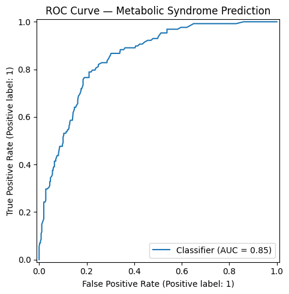
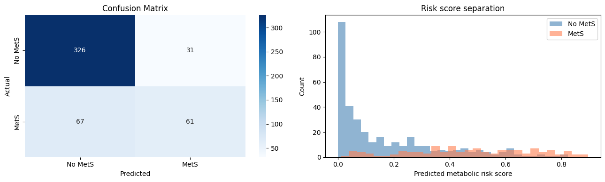
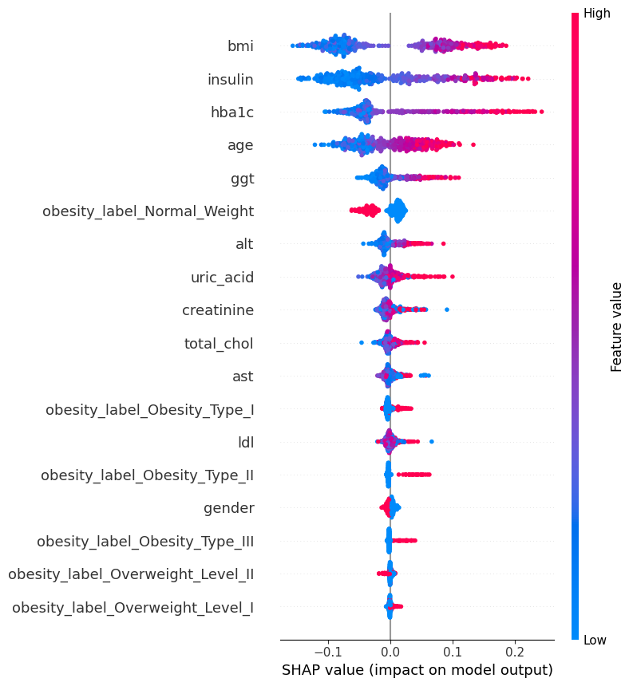
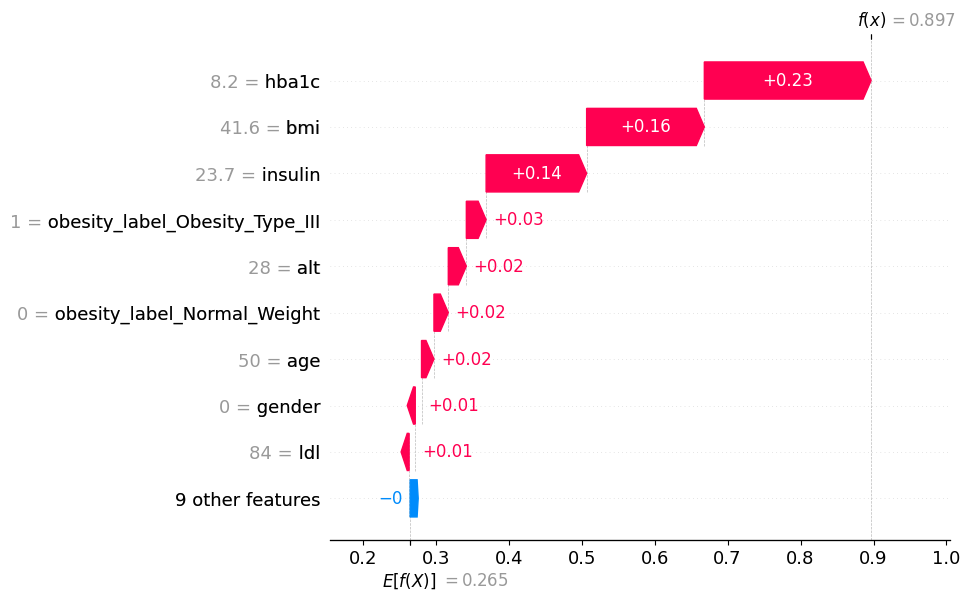

# Obesity-Aware Metabolic Risk Scoring System

An explainable machine learning framework that combines **obesity classification** with **metabolic syndrome probability estimation** using demographic, anthropometric, lifestyle, and clinical laboratory data.

The project uses two complementary datasets and demonstrates an end-to-end workflow covering data preparation, machine learning, model evaluation, explainable AI, and interactive prediction.

---

## Project Overview

Obesity and metabolic health are closely related, but body weight alone does not fully capture an individual's metabolic risk.

This project therefore uses a **two-stage machine learning framework**:

1. **Obesity Classification**
   - Classifies individuals into obesity-related categories using the UCI Obesity dataset.

2. **Metabolic Syndrome Prediction**
   - Estimates the probability of metabolic syndrome using clinical and laboratory measurements from NHANES 2013–2014.

3. **Explainable AI**
   - Uses SHAP to explain both global feature importance and individual predictions.

4. **Interactive Prediction**
   - Provides a Gradio interface for exploring model predictions using patient-level inputs.

> **Disclaimer:** This project is intended for educational and research purposes only. Model outputs are not medical diagnoses or clinical recommendations.

---

## Project Pipeline

```text
UCI Obesity Dataset
        │
        ▼
Data Cleaning & Preprocessing
        │
        ▼
Obesity Classification
        │
        ▼
Obesity Prediction
        │
        └──────────────┐
                       ▼
              NHANES 2013–2014
                       │
                       ▼
            Clinical Data Integration
                       │
                       ▼
          Metabolic Syndrome Target
                       │
                       ▼
             Model Comparison
                       │
                       ▼
              Random Forest
                       │
                       ▼
             Probability Prediction
                       │
              ┌────────┴────────┐
              ▼                 ▼
            SHAP             Gradio
        Explanations        Interface
```

---

# Stage 1 — Obesity Classification

The first stage uses the **UCI Obesity dataset** to classify individuals according to obesity-related categories.

### Dataset

- **2,111 observations**
- **17 features**
- **7 obesity-related target classes**
- Demographic, anthropometric, lifestyle, and behavioral variables

### Model Performance

| Metric | Score |
|---|---:|
| Test Accuracy | **99.53%** |
| Test Macro-F1 | **99.50%** |

The model demonstrates strong predictive performance on the held-out test set.

---

# Stage 2 — Metabolic Syndrome Prediction

The second stage uses integrated **NHANES 2013–2014** data to estimate the probability of metabolic syndrome.

### Dataset

- **2,422 complete-panel subjects**
- **26.4% metabolic syndrome prevalence**
- Demographic, anthropometric, biochemical, and clinical measurements

The metabolic syndrome target is constructed using **five clinical criteria**.

## Preventing Target Leakage

Because the metabolic syndrome target is defined using specific clinical criteria, the variables directly used to construct the target were excluded from the predictive feature set.

This prevents the model from simply learning the target definition instead of learning meaningful predictive relationships.

---

## Model Comparison

Three classification approaches were evaluated using **5-fold cross-validation**.

| Model | Mean ROC-AUC | Standard Deviation |
|---|---:|---:|
| Logistic Regression | 0.8446 | ±0.0288 |
| **Random Forest** | **0.8460** | **±0.0205** |
| XGBoost | 0.8250 | ±0.0247 |

The **Random Forest** model achieved the highest mean ROC-AUC and was selected as the final model.

### Held-Out Test Performance

**Test ROC-AUC: 0.8446**

---

# Model Evaluation

## ROC Curve

The ROC curve illustrates the ability of the final Random Forest model to distinguish between subjects with and without metabolic syndrome.



---

## Confusion Matrix

The confusion matrix shows the classification performance of the final Random Forest model on the held-out test set.



---

# Explainable AI with SHAP

Model performance alone does not explain *why* a prediction is made.

SHAP (SHapley Additive exPlanations) was used to interpret the Random Forest model at both the global and individual levels.

## Global Feature Importance

The global SHAP analysis highlights the features that contribute most strongly to the model's predictions.

Important features include:

- BMI
- Insulin
- HbA1c
- Age
- GGT
- ALT
- Uric Acid
- Creatinine
- Total Cholesterol
- AST



---

## Individual Prediction Explanation

A SHAP waterfall plot was also used to explain an individual prediction and show how different features influenced the model output.



---

# Interactive Prediction Interface

The project includes an interactive **Gradio** interface that allows users to enter demographic, anthropometric, and clinical measurements.

The interface provides:

- Predicted metabolic syndrome probability
- BMI
- Predicted obesity class
- Top factors influencing the prediction
- Direction of each feature's contribution

The interface is intended as an educational demonstration rather than a clinical decision-support system.

---

# Technologies Used

### Programming & Data Analysis

- Python
- Pandas
- NumPy
- Scikit-learn

### Machine Learning

- Logistic Regression
- Random Forest
- XGBoost

### Explainable AI

- SHAP

### Visualization

- Matplotlib
- Seaborn

### Interactive Interface

- Gradio

### Environment

- Google Colab / Jupyter Notebook

---

# Repository Structure

```text
obesity-aware-metabolic-risk-scoring/
│
├── README.md
├── requirements.txt
├── .gitignore
│
├── data/
│   └── README.md
│
├── notebooks/
│   └── obesity_metabolic_risk_analysis.ipynb
│
└── images/
    ├── roc_curve.png
    ├── confusion_matrix.png
    ├── shap_summary.png
    └── shap_patient.png
```

Raw datasets are intentionally excluded from the repository.

---

# Installation

Clone the repository:

```bash
git clone https://github.com/YOUR_USERNAME/obesity-aware-metabolic-risk-scoring.git
cd obesity-aware-metabolic-risk-scoring
```

Install the required dependencies:

```bash
pip install -r requirements.txt
```

Open the notebook:

```bash
jupyter notebook
```

Then open:

```text
notebooks/obesity_metabolic_risk_analysis.ipynb
```

---

# Limitations

- The models have not been clinically validated.
- NHANES represents a specific population and survey period.
- The predicted metabolic syndrome probability should not be interpreted as a clinical diagnosis.
- The two datasets contain different feature spaces and populations.
- External validation and probability calibration would be required before considering real-world clinical applications.
- Prospective evaluation would be necessary to assess performance in a real clinical setting.

---

# Future Improvements

Potential extensions include:

- External validation on additional datasets
- Probability calibration
- Hyperparameter optimization
- Cross-dataset feature harmonization
- Fairness and subgroup performance analysis
- Model monitoring
- Improved deployment architecture
- Clinical validation with domain experts

---

# Author

**Ghata**

Master's in Computer Science  
Stevens Institute of Technology

---

## Disclaimer

This project is for **educational and research purposes only** and is not intended to provide medical diagnosis, treatment, or clinical advice.
